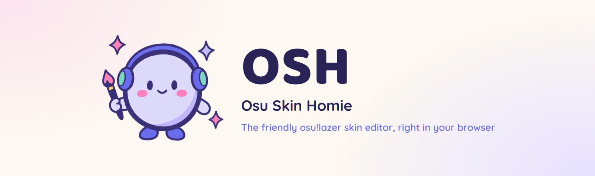
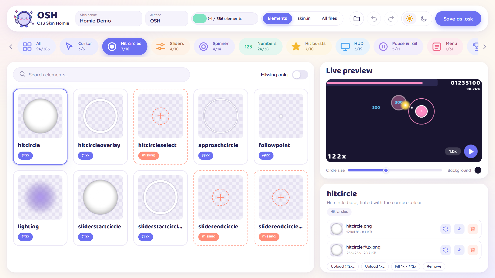
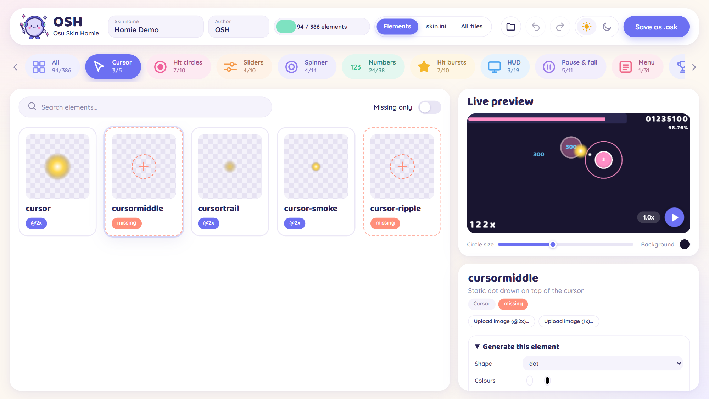
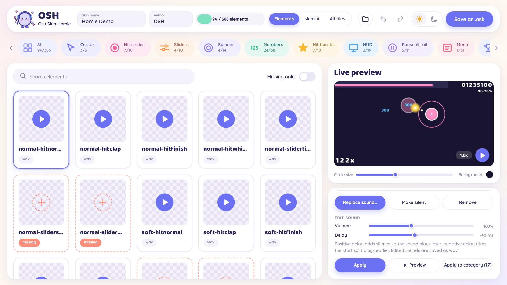
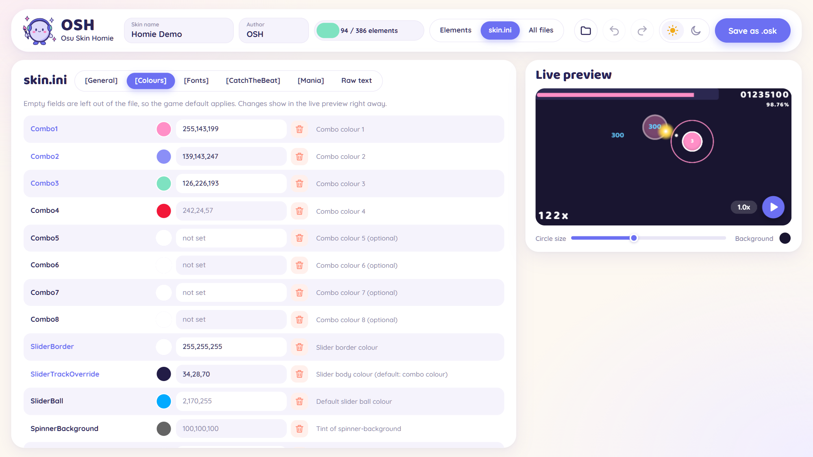
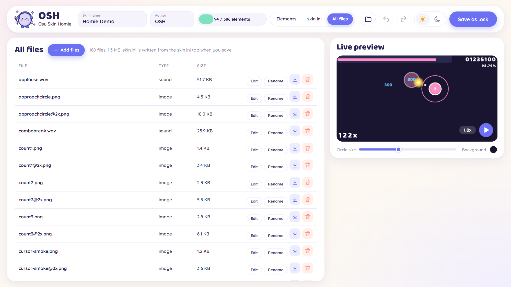
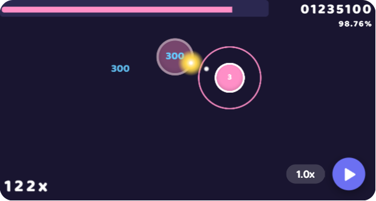
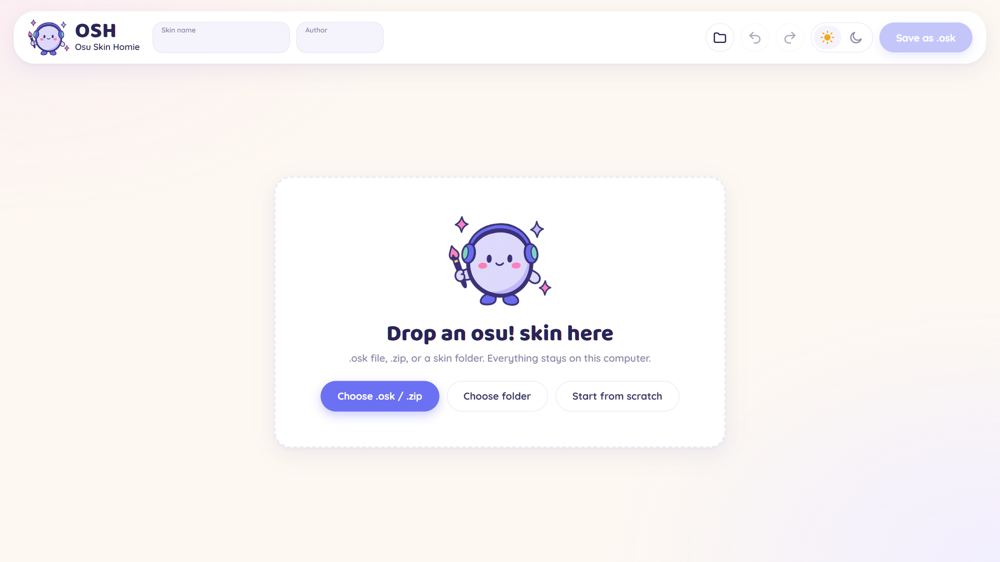

<p align="center">
  
</p>

<p align="center">
  <a href="https://chalupkavisuals.github.io/OSH/"></a>
  <a href="https://github.com/ChalupkaVisuals/OSH/releases/latest"></a>
  <a href="LICENSE"></a>
  <a href="https://github.com/ChalupkaVisuals/OSH/stargazers"></a>
</p>

<p align="center">
  A free, open-source skin editor and creator for <b>osu!lazer</b> (and osu!stable) that runs entirely in your browser.<br>
  Load any skin, see what it has and what it is missing, change every image, sound and <code>skin.ini</code> setting,<br>
  watch the result in a live preview, and save it as a brand new <code>.osk</code>.
</p>

<p align="center">
  <b>Nothing is uploaded anywhere. Your skin never leaves your computer.</b>
</p>

<p align="center">
  <a href="https://chalupkavisuals.github.io/OSH/"><b>Use it online</b></a>
  &nbsp;·&nbsp;
  <a href="#quick-start">Quick start</a>
  &nbsp;·&nbsp;
  <a href="#guide">Guide</a>
  &nbsp;·&nbsp;
  <a href="#running-locally">Run locally</a>
  &nbsp;·&nbsp;
  <a href="CHANGELOG.md">Changelog</a>
</p>

<p align="center">
  <picture>
    <source media="(prefers-color-scheme: dark)" srcset="docs/img/editor-dark.png">
    
  </picture>
</p>

## A quick look

<table>
  <tr>
    <td width="50%" valign="top">
      <br>
      <b>Fill in what is missing.</b> Dashed cards are elements your skin lacks. Upload one, or generate it from a shape or text.
    </td>
    <td width="50%" valign="top">
      <br>
      <b>Tune your sounds.</b> Make hitsounds louder or quieter and nudge their timing, one at a time or a whole category.
    </td>
  </tr>
  <tr>
    <td width="50%" valign="top">
      <br>
      <b>Every skin.ini setting.</b> Combo colours, fonts, cursor behaviour and all mania key counts, with defaults and descriptions.
    </td>
    <td width="50%" valign="top">
      <br>
      <b>Full control of the files.</b> Rename, add, download or delete anything, and edit lazer layout files as text.
    </td>
  </tr>
</table>

<p align="center">
  <br>
  <sub>The live preview draws a looping osu! scene with your own textures, colours and fonts.</sub>
</p>

<sub>Screenshots show a demo skin made entirely with OSH's built-in generators.</sub>

---

## Contents

- [A quick look](#a-quick-look)
- [Features](#features)
- [Quick start](#quick-start)
- [Guide](#guide)
  - [Importing a skin](#importing-a-skin)
  - [Elements tab](#elements-tab)
  - [Editing an image](#editing-an-image)
  - [Generating missing elements](#generating-missing-elements)
  - [Sounds](#sounds)
  - [skin.ini tab](#skinini-tab)
  - [Live preview](#live-preview)
  - [All files tab](#all-files-tab)
  - [Saving as a new skin](#saving-as-a-new-skin)
- [Running locally](#running-locally)
- [Project structure](#project-structure)
- [Development](#development)
- [Releases](#releases)
- [Limitations](#limitations)
- [Contributing](#contributing)
- [License](#license)

---

## Features

| Area | What you can do |
| --- | --- |
| **Import** | Open `.osk` and `.zip` files or a whole skin folder, by file picker or drag and drop. Start from a blank skin if you want to build one from nothing. |
| **Completeness check** | Every skinnable element (about 390 images and sounds across osu!, taiko, catch and mania) is listed. Elements your skin lacks are shown as dashed cards, with a per-category `have / total` count and a "Missing only" filter. |
| **Image editing** | Hue, saturation, brightness, contrast, opacity, colorize, resize, rotate and flip, with a live preview. Apply to one element or to a whole category at once. |
| **HD handling** | Understands `@2x` files and animation frames (`name-0`, `name-1` …). One click creates the missing 1x or `@2x` version of any image. |
| **Generators** | Create missing elements from scratch: circles, rings, glows, dots, arrows, stars, bars and text. Sensible presets for hit circles, approach circles, cursors, slider balls, number fonts, hit bursts, ranking letters and more. |
| **Sounds** | Play, replace, remove or silence any hitsound or UI sound. Make sounds louder or quieter and shift their timing earlier or later, one sound or a whole category at once. |
| **skin.ini** | A full form for `[General]`, `[Colours]`, `[Fonts]`, `[CatchTheBeat]` and every `[Mania]` key count, with defaults and descriptions, plus a raw text editor. Unknown keys and comments are preserved. |
| **Live preview** | Always on screen next to whatever you are editing. An animated osu! playfield drawn with your skin: hit circles, combo colours, numbers, approach circles, a slider, follow points, hit bursts, health bar, score, combo and a cursor with trail. Pause it or change its speed. |
| **File manager** | Rename, download, delete or add any file. Text files such as lazer's layout `.json` files can be edited in place. |
| **Undo / redo** | Every file change can be undone and redone (buttons, `Ctrl+Z`, `Ctrl+Y`). |
| **Themes** | Light and dark theme, remembered between visits. |
| **Export** | Saves a ready-to-import `.osk` under a new name, so your original skin is never touched. |

## Quick start

1. Open https://chalupkavisuals.github.io/OSH/ (or run OSH locally).

   

2. Drop your skin's `.osk` on the page.
   - In osu!lazer: `Settings → Skin → Export selected skin`, then find the file in the exports folder.
   - In osu!stable: zip your skin folder from `osu!/Skins/`, or just drop the folder itself.
3. Change whatever you like.
4. Type a name in the top bar and press **Save as new skin (.osk)**.
5. Double-click the downloaded `.osk`, or drag it into the osu!lazer window. It shows up as a new skin in `Settings → Skin`.

## Guide

### Importing a skin

Three ways, all equivalent:

- **Import .osk / .zip**: pick an archive.
- **Import folder**: pick an extracted skin folder.

  Both are on the start screen, and later under the folder button in the top bar.
- **Drag and drop**: drop an archive or folder anywhere on the page.

If the archive wraps the skin in a sub-folder, OSH finds the folder containing `skin.ini` and uses that as the root. After import the skin name gets a `(custom)` suffix so the export cannot be confused with the original. Change it to whatever you want.

Dropping loose image or sound files while a skin is open **adds them to the skin** using their file names. This is the fastest way to bring in elements from another skin.

### Elements tab

The row of chips at the top lists the categories with a count of how many elements your skin has; a tick marks complete ones. The bar in the header shows the total. The grid shows one card per element:

- solid card: the skin has this element
- dashed card: missing, osu! will fall back to its default
- `@2x` badge: an HD version exists
- `N frames` badge: the element is animated

Use the search box to filter by name and **Missing only** to see what is left to do. Files that are not part of the standard element set (extra images, lazer layout files, anything else) are kept under **Other files**.

Click a card to open it in the inspector on the right.

### Editing an image

The inspector lists every file belonging to the element (1x, `@2x` and each animation frame). For each file you can **Replace** it, download it or delete it.

- **Upload @2x… / Upload 1x…** adds a new image under the correct name. Non-PNG images are converted to PNG. For animatable elements you can select several files at once and they become frames.
- **Fill 1x / @2x** creates whichever resolution is missing for each file.
- **Adjust** changes colour and geometry. The preview updates as you move the sliders. Press **Apply** to write the change to every file of the element, or **Apply to category** to recolour a whole group (for example all hit bursts) in one go.

Tip: `hitcircle` and `approachcircle` are tinted with your combo colours in game, so they are normally kept white or grey.

### Generating missing elements

Open **Generate this element** (it opens automatically for missing elements). Choose a shape, colours, size, outline thickness and, for text, the text and font. The preview shows the result. **Generate & save** writes the `@2x` file and a half-size 1x copy.

The **blank** shape writes a 1×1 transparent image. That is the standard way to hide an element in game.

### Sounds

Sound cards have a play button. In the inspector you can listen, replace the sound with a `.wav`, `.ogg` or `.mp3`, remove it, or **Make silent** to write a silent file that mutes that sound in game.

Under **Edit sound**:

- **Volume** makes the sound quieter (below 100%) or louder (up to 400%). Very loud settings clip.
- **Delay** shifts the timing. A positive value adds silence in front so the sound plays later; a negative value trims the start so it plays earlier.
- **Preview** plays the result before you commit, **Apply** writes it, and **Apply to category** does the same to every sound in the category, which is handy for turning all hitsounds down at once.

Edited sounds are saved as 16-bit `.wav`.

### skin.ini tab

Each section is a form. Fields left empty are not written to the file, so the game default (shown as the placeholder) applies. Fields you have set are highlighted. The **✕** next to a colour clears it back to default.

- **[Fonts]** prefixes control which files are used for numbers. Changing a prefix immediately changes which font elements the Elements tab looks for.
- **[Mania]** has one section per key count. Pick the key count first. A dot marks key counts that already have settings.
- **Raw text** shows the whole file for direct editing. Keys OSH does not know about are kept exactly as written.

### Live preview

The panel on the right is visible on every page. It shows a looping osu!standard scene rendered with the current state of the skin. It reacts immediately to image edits and `skin.ini` changes (combo colours, slider border and track colours, font prefixes and overlaps, overlay order, cursor options). Move the mouse over the playfield to drive the cursor yourself. Use the play button to pause, the speed button to slow down or speed up, and the slider to try different circle sizes.

Elements the skin does not include are drawn as simple placeholders. In game, lazer uses its own default skin for those instead.

### All files tab

A plain list of everything in the skin, with size and type. **Edit** jumps to the element in the Elements tab, **Rename** changes the file name, and **Add files…** brings in any file under its own name.

### Saving as a new skin

**Save as new skin (.osk)** writes `skin.ini` from the current settings, packs every file and downloads `<skin name>.osk`. The name in the top bar becomes both the file name and the `Name` in `skin.ini`, which is what osu! shows in its skin list.

## Running locally

OSH is a static web app with no dependencies. You only need [Node.js](https://nodejs.org) 20 or newer to serve the files.

```bash
git clone https://github.com/ChalupkaVisuals/OSH.git
```

```bash
cd OSH
```

```bash
npm start
```

Then open http://localhost:5173. On Windows you can also double-click `start.bat`, which starts the server and opens the browser.

Any other static file server pointed at the `public/` folder works as well. Opening `index.html` straight from disk does not, because browsers block JavaScript modules on `file://` pages.

A current version of Chrome, Edge or Firefox is required.

## Project structure

```
public/
  index.html        page shell
  img/              mascot and tab icon
  css/style.css     styles
  js/app.js         state, UI, import and export
  js/zip.js         zip reader and writer (.osk is a zip)
  js/ini.js         skin.ini parser, serializer and settings schema
  js/catalog.js     list of every skinnable element
  js/gen.js         shape and text generators for missing elements
  js/imageops.js    image adjustments
  js/audioops.js    sound volume and timing, wav encoder
  js/preview.js     live gameplay preview
server.js           tiny static server for local use
test/               unit tests (node:test)
```

No build step, no framework, no runtime dependencies. Zip compression uses the browser's built-in `CompressionStream`.

## Development

```bash
npm test
```

runs the unit tests for the zip, `skin.ini`, catalog and audio modules. CI runs them on every push and pull request.

## Releases

Every update is published as a [GitHub release](https://github.com/ChalupkaVisuals/OSH/releases). The version lives in `package.json` and the notes in [CHANGELOG.md](CHANGELOG.md). Each release has the matching changelog section as its notes and a zip of the app attached. The hosted version on GitHub Pages is updated at the same time.

## Limitations

- The live preview shows osu!standard gameplay only. Taiko, catch and mania elements can be edited but are not previewed in motion.
- lazer's layout files (`*.json` created by the in-game skin layout editor) are kept and can be edited as text, but there is no visual editor for them.
- Zip64 archives (over 4 GB) are not supported.

## Contributing

Bug reports, ideas and pull requests are welcome. See [CONTRIBUTING.md](CONTRIBUTING.md).

## License

[MIT](LICENSE). OSH is a community project and is not affiliated with or endorsed by ppy Pty Ltd. "osu!" is a trademark of ppy Pty Ltd.
